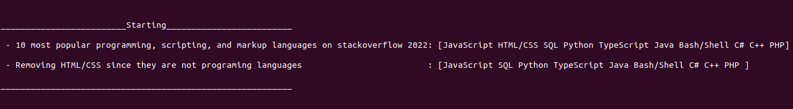

# Informações gerais 

## Compilação 

A partir da pasta raiz do projeto para 

- Compilar: Digite "make" 
- Executar: Digite "make run" 

O arquivo executável fica em ./build 

## Sistema 

Desenvolvido no Ubuntu 22.04 LTS 

# Template de uma lista duplamente encadeada 
## Definição 

As listas são um tipo de estrutura de dados a qual contém uma coleção ordenada de valores. Uma lista duplamente encadeada conecta os valores com seu antecessor e seu sucessor, permitindo que a mesma seja percorrida do início para o fim e do fim para o início. 

## Implementação 
### Nó 

A partir desse conceito em [list.hpp](src/list.hpp) foi criado uma struct chamada de node (nó), a qual representa os valores da lista, portanto ela possui 3 atributos 

- value -> o valor a ser armazenado. Do tipo "T" definido em Template <typename T>. 
- before -> Um ponteiro para o tipo node. Aponta para o nó anterior da lista. 
- after -> Um ponteiro para o tipo node. Aponta para o nó posterior da lista. 

### Lista 

também em "list.hpp" foi criada a classe list que possui como  
#### Atributos 

- root -> Um ponteiro do tipo node<T>. Endereça o primeiro elemento da lista. 
- edge -> Um ponteiro do tipo node<T>. Endereça o último elemento da lista. 

#### Construtor 

O construtor, assim como os métodos da classe estão implementados em [list_implementation.hpp](src/list_implementation.hpp). O construtor aloca memória para "root" e "edge" e endereça que o sucessor de root é edge e o antecessor de edge é root. 

#### Método Insert 

O método insert recebe 2 parâmetros:  

- O valor a ser inserido 
- A posição no qual ele será inserido 

e a partir deles insere o valor na posição especificada. 
 
##### Tratamento de exceções 

Se a posição for inválida o método irá: 

- Se posição < 0 -> o valor será adicionado no início da lista 
- Se posição > tamanho da lista -> o valor será adicionado ao fim da lista 

#### Operator [] 

A sobrecarga do operador "[]" permite recebe uma posição da lista e retorna o valor daquela posição. Ela pode ser acessada com um comando do tipo: leitura = lista[pos]; , onde leitura é do tipo T, lista é do tipo list<T> e pos é um inteiro. 

##### Tratamento de exceções 

Se a posição for inválida o operador irá retornar uma instancia do tipo "new T" 

#### Método Remove 

O método remove recebe como parâmetro a posição da qual o valor será removido da lista. Ele faz com que o antecessor do item a ser removido receba com sucessor o sucessor do mesmo, bem como faz com que seu sucessor receba como antecessor o seu próprio antecessor. Por fim seu endereço de memória é desalocado. 

##### Tratamento de exceções 

Se a posição for inválida o método não irá alterar a lista 

### printlist 

A função printlist criada em [main.cpp](src/main.cpp) recebe como parâmetro uma lista do tipo list<T>, e, a partir do operador "[]" imprime todos os valores da lista. Ela foi criada a fim de debuggar e demonstrar o funcionamento do template da classe list. 

## Execução 

A fim de testar as funcionalidades do template list foi criada na [função main](src/main.cpp) uma lista do tipo list\<std::string\>, na qual foram adicionadas as 10 linguagens de programação mais populares do stackoverflow survey 2022, assim validando o método de inserção. Após isso a lista é impressa, validando o método de pesquisa (operator []), e por fim um dos elementos da mesma é removido, validando o método de remoção. A lista modificada é impressa novamente. 

Resultado: 

 
